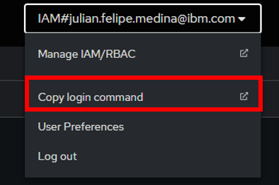
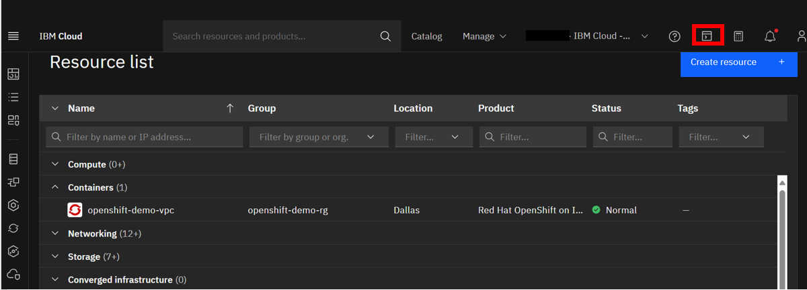
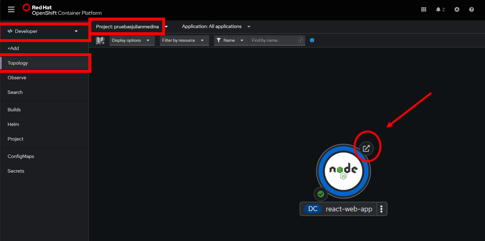
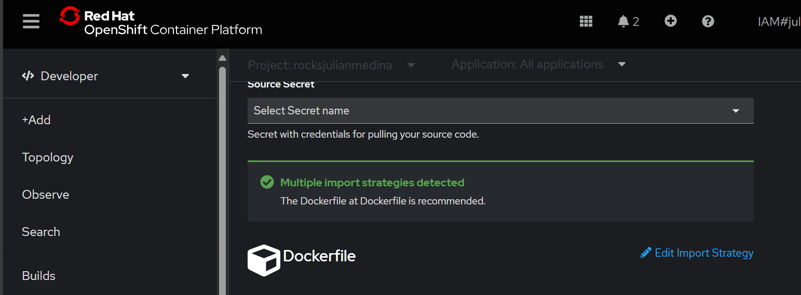
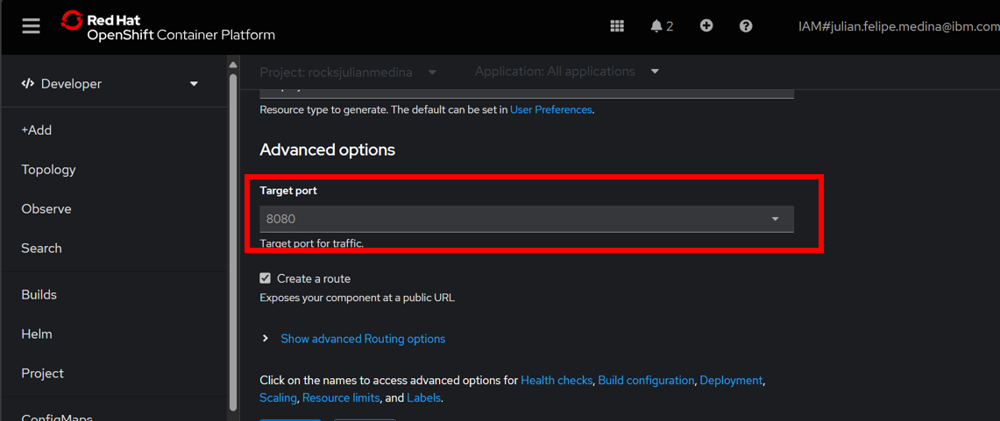
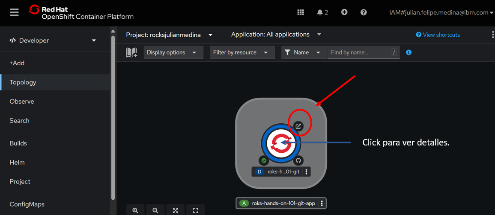
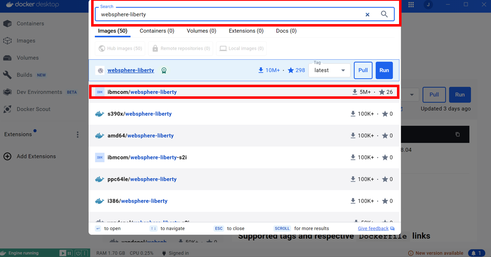

# ROKS-React---HandsOn-101 :cloud:


Para el desarrollo de esta guia de despliegue, se tiene como base el desarrollo de una aplicación basada en la librería React de javascript y su posterior despliegue en un **Cluster de OpenShift** que se encuentra alojado en **IBM Cloud**.

<br />

### Indice
1. [Despliegue sobre OpenShift desde IBM Cloud shell](#despliegue-sobre-openshift-desde-ibm-cloud-shell)
2. [Despliegue Aplicación Demo en React :atom_symbol:](#despliegue-aplicación-demo-en-react-atom_symbol)
3. [Despliegue Aplicación Feedback App Desde la consola web de OpenShift 📦](#despliegue-aplicación-feedback-app-desde-la-consola-web-de-openshift-)
4. [Monitoreo de la aplicación](#monitoreo-de-la-aplicación)
5. [Despliegue de una imagen Docker en un contenedor de Openshift](#Despliegue-de-una-imagen-Docker-en-un-contenedor-de-Openshift-)
6. [Referencias](#Referencias)

<br />

## Despliegue sobre OpenShift desde IBM Cloud shell:🚀

### Acceder a IBM Cloud Shell y v.
#### <p>Dir&iacute;jase a la p&aacute;gina de <a href="https://cloud.ibm.com/">IBM Cloud</a></p>
1.	Asegurese de estar en la cuenta en la cual se va a desplegar la aplicación, para ello vaya a **Resource List** y posteriormente a **Containers**, debe tener **activa** la instancia de openshift:
  <br />
<p align="center"></p>
<br />

2.	Ingrese a la instancia de openshift y dar click en **OpenShift web console**:

   <br />
<p align="center">
</p>
<br />

3. En la parte superior derecha, de click en el usuario y posteriormente de click en el boton **Copy login command**:

   <br />
<p align="center">
</p>
<br />

4. Copie y pegue el **"Log in whith this token"** y peguelo en IBM Cloud Shell, para acceder a IBM Cloud Shell debe volver a IBM Cloud y presionar el siguiente botón:
   <br />
<p align="center">
</p>
<br />

5. Pegar el **"Log in with this token"** en consola y ejecutarlo; para pegar una linea de texto, usar **Shift + Ctrl + V**. Al ejecutar el comando, este debe ser el resultado:

   <br />
<p align="center">
</p>
<br />
6. Para validar el acceso a la instancia de openshift, ejecutar la siguiente linea de codigo.

   ```
   oc projects
   ```
   

### Cree un nuevo proyecto en OpenShift para desplegar las aplicaciones 📦
1.	Cree un nuevo proyecto en el clúster de la siguiente manera:

   ```
   oc new-project <projectname>
   ```
   
   **Nota:** Para el **projectname** coloque **roks + las iniciales de su nombre y apellido.**
   <br />
   
2.	Acceda al proyecto que acabó de crear de la siguiente manera:

   ```
   oc project <projectname>
   ```   
   <br />

## Despliegue Aplicación Demo en React :atom_symbol:

1.	Desde el Shell de IBM cloud digite el siguiente comando para crear una aplicación de react:

   ```
   npx create-react-app react-web-app
   ```
   **Nota:** Si solicita instalar algún paquete, instalelos.
   <br />
   
2.	Dirigirse a esta carpeta con el comando:

   ```
    cd react-web-app
   ```
   
   <br />
   
3.	Para desplegar la aplicación en OpenShift es necesario escribir el siguiente comando:

   ```
   npx nodeshift --deploy.port 3000 --expose
   ```
   <br />
   
   El resultado de este comando va a ser una respuesta de este tipo, que nos indica que la aplicación se desplegó correctamente.
   <br />
   
   <br />
<p align="center"></p>
<br />
   
   <br />

4.	Para poder acceder al la URL de la aplicación y realizar la verificación de la misma, ingrese a la consola web de OpenShift en el apartado  **Developer**, en la vista **topology** y asegurando estar en el proyecto creado, de click en el botón señalado a continuación.

**Nota:** Debe asegurarse que la aplicación haya finalizado de desplegarse, generalmente toma un par de minutos.
   
   <br />
<p align="center"></p>
<br />


   
   De esta forma se daría por terminado el despliegue de la aplicación react en openshift.

   <br />
   
   
## Despliegue Aplicación Feedback App Desde la consola web de OpenShift 📦 

Para realizar el despliegue desde la consola web de OpenShift de una  manera más intuitiva se deben seguir los siguientes pasos:

7. Cree un nuevo proyecto con la siguiente sintaxis **handson-nombreapellido**.

<p align="center">

</p>

<br />

8. Ingrese a la sección add y luego debe elegir From Catalog.

<br />
   <p align="center"></p>
<br />

9. Ingrese la URL del repositorio de GitHub que contiene la aplicación a desplegar, si lo desea puede ser la siguiente:

[[https://github.com/emeloibmco/ROKS-HandsOn-101/edit/main/README.md#despliegue-aplicaci%C3%B3n-feedback-app-desde-la-consola-web-de-openshift-](https://github.com/emeloibmco/ROKS-HandsOn-101/blob/main/README.md#despliegue-aplicaci%C3%B3n-feedback-app-desde-la-consola-web-de-openshift-)
](https://github.com/emeloibmco/ROKS-HandsOn-101.git)

 **Nota:** Fijese que el **"Import Strategy"** sea por medio de Dockerfile. Este metodo es el recomendado para esta guia.  
img/comprodockerfile.png


<br />
   <p align="center"></p>
<br />


10. Una vez seleccionada, presione ```Show Advanced Options``` y baje hasta ```Show Advanced Routing Options```. En el puerto ingrese el puerto donde se expone la aplicación creada. En este caso de prueba **8080**, a menos que haya sido cambiado en el desarrollo de la aplicación.

<br />
   <p align="center"></p>
<br />

11. Al final de esta página encontrará una sección de opciones avanzadas en la cual encontrará un link de **Scaling**.

<p align="center">

</p>

<br />

12. La sección de **Scaling**, nos permitirá configurar el número de replicas si deseamos un auto escalamiento para nuestra aplicación.

<p align="center">

</p>

<br />

13. Al dar clic en crear se iniciará un proceso de build el cual nos entregará el link de despliegue de nuestra aplicación".

<br />
   <p align="center"></p>
<br />


**Nota:** Espere unos cuantos segundos mientras el proceso de construcción y despliegue de la aplicación se termina.

<br />


## Monitoreo de la aplicación

Para realizar monitoreo de la aplicación desplegada debe seguir los pasos que se indican a continuación:

1. Hacer click en la sección **Observe**
2. Hacer click en la pestaña del proyecto (parte superior), allí busque y seleccione el proyecto donde desplegó la aplicación, el que tenía la sintaxis **handson-nombreapellido**.
   


4. En la sección **Dashboard** puede seleccionar las siguientes opciones.

<p align="center">

</p>

5. También puede seleccionar la sección **Metrics** y seleccionar alguno de los siguientes query.

<p align="center">

</p>

<p align="center">

</p>

De estas dos maneras puede ver y analizar el consumo que ha tenido la aplicación en cuanto a CPU y memoria. 


## Despliegue de una imagen Docker en un contenedor de Openshift 📦

Para realizar el despliegue de una aplicación que se encuentra alojada en un una imagen de DockerHub se deben realizar los siguientes pasos:

1. Por medio de **Docker Deskpot**, vamos a buscar **"websphere-liberty"** , vamos a seleccionar la que aparece en la siguiente imagen:

<p align="center">

</p>

2. Luego, vamos a Copiar **Solamente** la porción de la linea de texto señalada:
<p align="center">

</p>
   

3. Luego, nos dirigimos a la consola Web de OpenShift y va a dar click en la sección **Add** y luego en la sección ***Container Image*.

<p align="center">

</p>

<br />

2. Al dar clic en Container Image se abre una ventana en la cual debemos seleccionar el campo **Image Name** y llenar el campo con la ruta fuente de la imagen docker y da al click al botón **Crear**.


<br />


3. Una vez terminado el proceso de despliegue puede dirigirse a Overview dando clic sobre el circulo de despliegue, donde podra ver la URL mediante la cual podra acceder a la aplicacion ya desplegada.

<p align="center">

</p>
<br />

5. al dar clic en la URL podrá acceder a la aplicacion ya desplegada.


<br />

## Referencias

* La documentación en linea de IBM Cloud Red Hat OpenShift Managed, se encuentra en el siguiente enlace: https://cloud.ibm.com/docs/openshift?topic=openshift-getting-started

* En la siguiente página se encuentra la información de administración y configuración de Open Shift 4.11: https://access.redhat.com/documentation/en-us/openshift_container_platform/4.11
<br />

* [Nodeshift](https://nodeshift.dev/)

## Autores ✒️
Equipo *IBM Cloud Tech Sales Colombia*.

